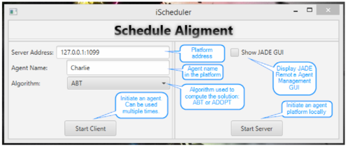
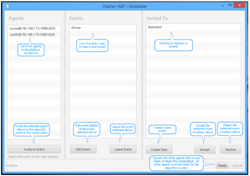
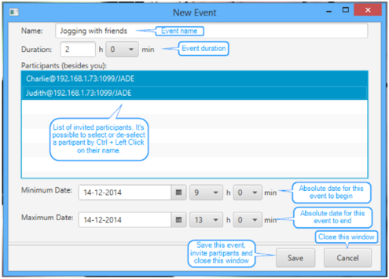
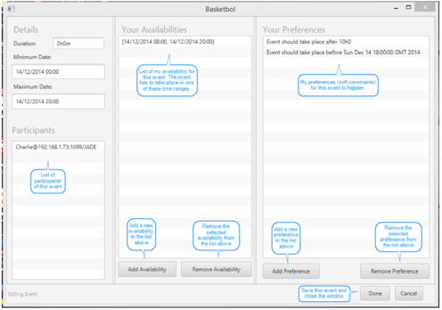
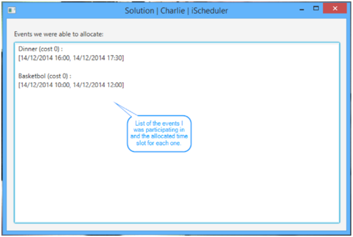

Schedule Alignment
==================

AIAD - Agents and Distributed Artificial Intelligence (EIC0033, MIEIC, FEUP)
----------------------------------------------------------------------------

## Summary

> The purpose of this project was to develop a tool to solve schedule alignment
problems. This type of problems consist of having several agents attempting to
organize activities between them. All activities must be scheduled for a time
interval where all participants can attend for a solution to be valid. Aditionally,
activities can not overlap if they have participants in common since an agent
can only attend one activity at a time. A solution can also be better or worse
depending on the weak constraints it satises. For example, an agent may prefer
to have an activity at a given time but also be able to participate if it can't
be scheduled for that time interval. In this case, multiple solutions may be
acceptable but the ones that satisfy the agent's preference will be better.

> To this end, multiple algorithms for solving distributed constraint optimiza-
tion problems have been implemented and analysed, using the JADE platform to
implement the agents. The algorithms chosen to be implemented were ADOPT
and a modified version of ABT made to solve this type of problems.

Further info: [full report](docs/t04-schedule-alignment.pdf)

## Authors

- [Duarte Duarte](https://github.com/dduarte) - ei11101
- [Luís Cleto](https://github.com/luiscleto) - ei11077

## Algorithms

- ABT-opt (Asynchronous Backtracking)
- ADOPT (Asynchronous Distributed Constraint Optimization with Quality Guarantees)

## Technologies

- Java (implementation language)
- JavaFX (graphical user interface)
- JADE (Java Agent DEvelopment Framework)

## Screens

Main interface - start a JADE platform or create multiple agents

Main agent interface - display events, events invitations and other agents

Create event interface - create a new event, dene event details and invite other agents

Edit event interface - accept an event invitation or edit an existing event, dene your availabilities and preferences

Solution interface - displays the allocated time slot for each event
